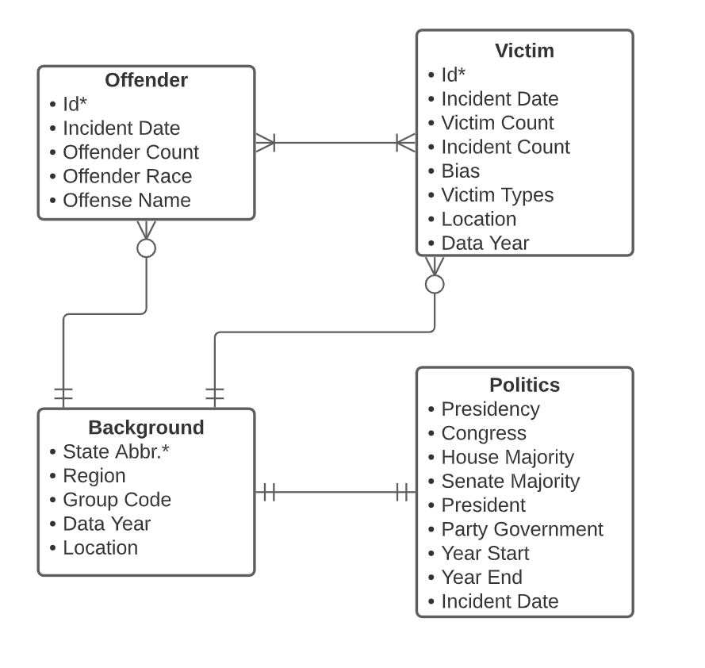

# Final_Project
###### Angela Spencer, Clarine Esperance, Ayesha Patel
###### March 9, 2022

### FBI Crime Data Explorer - Hate Crime Dataset
###### https://crime-data-explorer.fr.cloud.gov/pages/explorer/crime/hate-crime
Incidents of hate crimes have been on the rise in the United States, especially now, during politically charged times. There are different motivation behind the various hate crimes reported in the United States: religious discrimination, racial/ethnic discrimination, sexual orientation.

### Preprocessing
Two csv files were used to import US hate crime statistics from 1991-2020 as well as political climate, measured by political affiliation of the President, House of Representatives, and Congress. The two csv files were preprocessed seperately and then merged on year data later.
###### Data Cleaning
Observations with null values for OFFENDER_RACE were replaced with 'Unknown' and rows missing more than 70% of the data were dropped. We attempted to preserve the total number of incidents and remove as few data points as possible. There were many overlapping categories for the following fields: VICTIM_TYPE, BIAS_DESC, and LOCATION_NAME. We used regex .replace() to condense these categories into as few as possible to streamline the data. 
###### Feature Engineering
After the dataframes were cleaned and the contents had been explored through visualizations, we engineered two columns: INCIDENT_MONTH that included the year and month of the incident and INCIDENT_COUNT which was initially set to 1 for each incident and used later to aggregate and sum data when grouping.
###### Aggregating Data
The combined, cleaned, and engineered dataframe was grouped in various ways and on different features to be analyzed later.  These groupings included INCIDENT_MONTH, REGION_NAME, OFFENDER_RACE, BIAS_DESC, STATE_ABBR, and PRESIDENCY.  The groupings always included a sum of TOTAL_INCIDENTS and initally we aggregated more info such as the mode of BIAS_DESC, OFFENDER_RACE, and VICTIM_TYPE, but found that these additional columns were interesting to explore, but did not hold enough variation to make modeling possible.
###### Timeseries
One of the aggregated dataframes was further processed for timeseries analysis, this included setting a period frequency to monthly and converting the date column to a DateTimeIndex format.  When plotting and exploring this timeseries dataframe, two large spikes in TOTAL_INCIDENTS became very apparent. Based on this observations, we created an additional timeseries dataframe with outlier incident counts reduced to the average of the year before and after for years that were below the outlier threshold of 1000 incidents. 

### ETL Process
The combined hate crime and political data was extracted from the csv, transformed through preprocessing, feature engineering, and splitting on columns, and loaded into Postgres using Psycopg2 and SQLalchemy modules. 
###### LucidChart Database Model

###### Extracting
Data was extracted and cleaned using pandas and numpy modules in the Data_Preprocessing.py file. We discovered that Postgres did not like the format of our column titles and so some additional cleaning was required to rename columns. 
###### Transforming
After doing the necessary preprocessing, we divided our main data frame into 4 sub tables: Victim, Offender, Background and Politics. 
###### Loading
We then established a connection with our database through PsycoPG2 and used a SQLalchemy engine to create tables in Postgres from pandas dataframes.

### Data Exploration through Queries
Once the data was loaded into Postgres, we formulated queries that allowed us to dive deeper into the data and create visualizations. Before extracting the more interesting information we confirmed some of the more apparent observations we had and displayed them in tables. Among those observations are that Anti-black and Anti-white hate crimes are the top biases for all years in the 30 year period with California having the highest hate crimes overall. We then wanted to take a closer look at the biases, offender groups and victim types so we formulated queries that  gave us a better understanding of that data. Through these visuals, we were able to see the progression of the different kinds of hate crimes over the 30 year period and the sudden spikes and changes in the graph at key points in our history—9/11, the COVID pandemic and the months just before the January 6th domestic attack on the Capitol Building. Next, we wanted to see how the top biases change as we group by the different victim types. This allowed us to extract the biases that were not as apparent in our initial observations. For instance, Anti-Jewish crime is considerably high when religious and financial intuitions are taken into account. Through these visuals, it was also fascinating to see how the landscape of the graph changes drastically with the religious organization as the victim-type. 

### Unsupervised Machine Learning
Unsupervised Machine Learning was used to check for any patterns among states when it comes to incidents of crime motivated by bias. The two features evaluated by state were incidents count and bias description. In addition to checking for similarities among states with all biases, we took a closer look at a specific bias, Anti-Black, since it was consistently the top bias behind hate crime motivation. 
###### K Means Clustering and Heirarchical Clustering
The data was normalized to change the numeric columns to a common scale. KMeans and Hierarchical Clustering was to group similar states together. A k-means model was instantiated and provided a range of numbers for the clusters. The elbow method was used to determine the optimal number of clusters.  A visual of the state clusters was used to show how the states are clustered biased on bias and incidents count. The clustering of the states did change when evaluating just Anti-Black bias and when evaluating states for all biases. 

### Timeseries Analysis
For the timeseries analysis, we explored the data to understand the components that are unique to timeseries data: stationarity, seasonality, autocorrelation, and partial autocorrelation.  The timeseries showed characteristics of all of these components, which were analyzed using the module statsmodels.  We used a SARIMAX model for the timesereis data and created a function to accept inputs and return a sumamry of performance (including AIC and BIC performance metrics), a 3 plots: predictions, 1 year forecast, and 5 year forecast overlayed on the original observations.  This function was called for the timeseries dataframe with outliers intact and the dataframe with outliers removed.  The timeseries with outliers removed had better performance overall, likely due to a spike of outliers at the end of the dataset that would be difficult to predict.  
###### Parameter Tuning
The ARMA portion of the model accepts p, d, and q as parameters (autoregressive lags, differencing/intigration order, and moving average lags, respectively) and the S portion of the model accepts P, D, Q, and S (P, D, and Q relate to the ARMA pdq and S realtes the period frequency of seasonality). A manual gridsearch function was used to create all possible combinations of pdq and PDQ  for each value between a given range, the seasonality was always set to S=12. The gridsearch used BIC as the performance metric to lower.
###### Validation
The  SARIMAX model was validated by creating a function to manually split the dataset into a train and test set using the final 15% of the timeseries for validation.  Predicted validation results were plotted against actual results for both dataframes with and without outliers.

### Supervised Learning
The supervised learning models that had the best performance were based on time and so a dataframe using the INCIDENT_MONTH, TOTAL_INCIDENTS, BIAS_DESC, REGION_NAME, and PRESIDENCY was categorically encoded and used with various combinations of variables and fitted to a Random Forest Regressor model, a K Nearest Neighbors Regressor model, and a PyTorch Neural Network model. Of these various combinations of variables and models, we found that the dataframe containing INCIDENT_MONTH, REGION_NAME, BIAS_DESC, and TOTAL_INCIDENTS outperformed other combinations and that the Random Forest and Neural Network models outperformed the KNR model.  

In order to predict based on time, we used the pandas shift() and diff() functions to engineer lags. This resulted in each row containing the TOTAL_INCIDENTS for the given month plus 4 new columns: MONTH-1 (the number of incidents in the previous month), MONTH-2 (the number of incidents two month before), MONTH-1_DIFF (the difference between the current month and previous month), and MONTH-2_DIFF(the difference between the previous month and 2 months before).

To run the models, functions were created for validation splits, for processing the dataframes into tensors for Pytorch and for running the models/plotting results. Mean Absolute Error was used as the performance metric for all Supervised Learning regression models.

###### Parameter Tuning
A manual gridsearch through available optimizers was created to find the best optimizer for the Neural Network. Gridsearch was used to tune the number of estimators for the Random Forest Model and the learning rate for the Neural Network. Lasso regression was also used to find the feature engineered columns that contained the most variation in the dataset in order to streamline the model's performance and reduce noise.

###### Validation
A train test split function was created to split the time series, withholding the last 15% of the dataset for validation and comparison.

### Conclusions
We expected to find that presidency and political climate might have an effect on the total number of incidents in a given region or nationwide, but the data did not support this.  Instead, we discovered that time, region, and number of incidents per bias type is the greatest predictor of future numbers of incidents.  This leads us to believe that correlation is related to current events and social issues as we can clearly see with the spike in incidents corresponding to the events of September 11, 2001 and January 6, 2021. 
